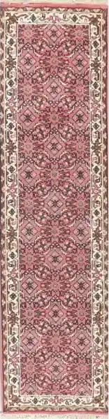

# ACME Rugs Demo Page
> Demo page for a fictitious _Rugs Store_ online business. The goal is to demonstrate how to capture custom events with Google Analytics

## License
This simple example has ben released under the [BSD 3-Clause License](./LICENSE.md).

## Folder Structure

### `./src`
TypeScript and LESS source code.

### `./dist`
Distribution files resulting from teh compilation and building of teh source code. 

### `./img`
Images used by the application. The images are required in order to generate a correct deployment.

## Build
To build a deployable version of the code run the command `npm run build` for the production version, and `npm run build-dev` for the development version.

## Google Analytics Custom Events
The example included in this repository are based on GA 3, and on the ga.js library. The example are visible in the file [`acme.ts`](./src/acme.ts)

## Additional Information
This page has been described and explained in a blog post on Medium titled [Google Analytics Custom Events: from Clicks to Reports](https://folini.medium.com/google-analytics-custom-events-from-clicks-to-reports-beb274a95f3e).

## Carpets
This example comes with 4 carpets.

---
Copyright (c) 2021, Franco Folini
All rights reserved.

